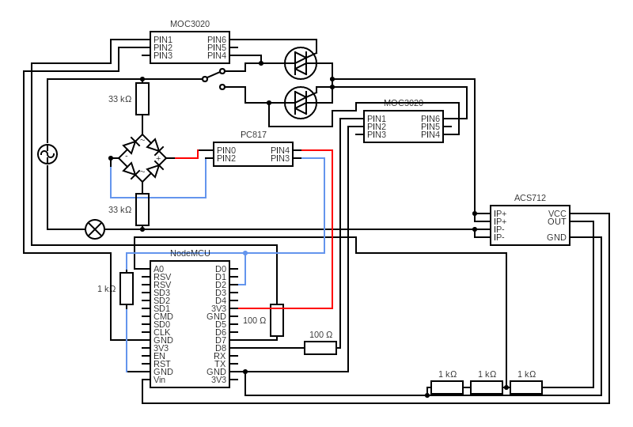

# Home Automation with Nodemcu ESP8266
Home automation with circuit diagram and code

ESP8266 with some electronics gives you control over your lights, fans or any electrical appliances leaving you resting on your sofa :).

## Circuit diagram:

## Instructions
What you need:

* 1 x Nodemcu ESP8266
* 1 x ACS712 5A
* 1 x Full Bridge Rectifier / 4 x IN4007 diode
* 1 x PC817 optocoupler
* 2 x MOC3020 optocoupler / 2 x MOC3021 optocoupler
* 2 x BTA16 triac
* 2 x 33k ohm resistor
* 2 x 100 ohm resistor
* 4 x 1k ohm resistor
* 1 x switch
* 1 x Bulb Holder
* 1 x Plug
* 1 x Soldering Iron
* 2 m Soldering wire
* Jumper Wires
* 1 x Perf Board (small)
