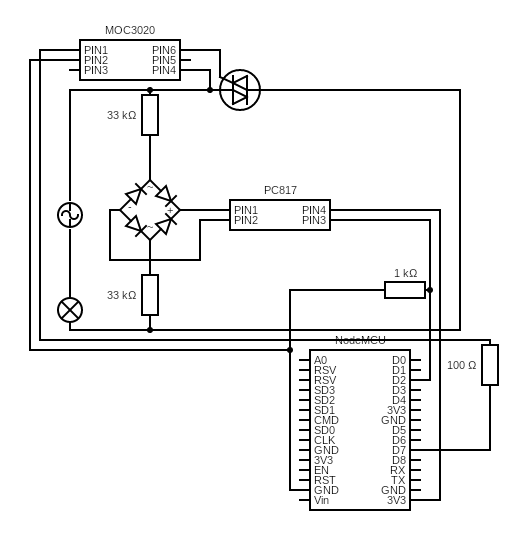

# Home Automation with NodeMCU ESP8266
Home automation with circuit diagram and code

ESP8266 with some electronics gives you control over your lights, fans, or any electrical appliances, leaving you resting on your sofa :).

## Circuit diagram:


## Instructions

What you need:

* 1 x Nodemcu ESP8266
* 1 x ACS712 5A
* 1 x Full Bridge Rectifier / 4 x IN4007 diode
* 1 x PC817 optocoupler
* 2 x MOC3020 optocoupler / 2 x MOC3021 optocoupler
* 2 x BTA16 triac
* 2 x 33k ohm resistor
* 2 x 100 ohm resistor
* 4 x 1k ohm resistor
* 1 x switch
* 1 x Bulb Holder
* 1 x Plug
* 1 x Soldering Iron
* 2 m Soldering wire
* 1 x Perf Board (small)
* Jumper Wires

### Zero Cross Detection
AC Current is a sine wave ranging from x to -x, when the current is zero it is called *ZERO CROSSING*. If we can control a switch very fast(~ 10ms) to cut the sine wave, we can control the power. The Triac will be a suitable component to do so. If you are like me you will get 50Hz, so a sine wave will last 20ms and every zero crossing will occur every 10ms.  After we detect the zero crossing, we give a delay of 2000 microsenconds to 9000 microseconds (results may vary) then fire the triac, we can cut the sinwave accurately and control power given to the load.

 
 - Credit goes to ElectroNoobs Youtube

 To Detect Zero Crossing we will use a Full bridge Rectifier, PC817 optocoupler, 2 33k ohm ressistors and the D2 pin of the NodeMCU.
 
 Here is the schematic:
 
 
 
 
 
 And Code:
 
 ```C
 void setup() {
  Serial.begin(115200);
  pinMode(D2, INPUT);
  attachInterrupt(digitalPinToInterrupt(D2), zcd, FALLING);
}

void loop() {
}

void zcd() {
  Serial.println("Now");
}
 ```
 
The input at D2 will be a trapezoidal wave (DC) with peak value of the voltage given to PIN4 at PC817, in this case it is 3.3v . We detect the LOW value using NodeMCU then Serial.println("NOW"). It should happen 100 times a second. 🎉 Zero Cross Detection is over.
 
 
 
### Firing The Triac

Ok now lets see if our triacs and MOC3020 optocoupler works.
We will just modify our circuit a bit and change a bit of our code.

Schematic:




Code:

```C
int delayto = 2000;
void setup() {
  Serial.begin(115200);
  pinMode(D2, INPUT);
  pinMode(D7, OUTPUT);
  attachInterrupt(digitalPinToInterrupt(D2), zcd, FALLING);
}

void loop() {
}

void zcd() {
  delayMicroseconds(delayto);
  digitalWrite(D7, HIGH);
  delayMicroseconds(50);
  digitalWrite(D7, LOW);
}
```
__A Triac stays conductive till the polarity of the current changes___. So in this example we fire the triac after the zero cross with a delay of 2000 microseconds which, according to my test gives full power to my load. Changing the *delayto* from 2000 - 9000 can control power. Test this in both of the triacs and MOC3020. What is left is to add cloud functionality so that we can control the power from any where in the world (where there is Internet connection) and adding a two way switch.

### Cloud functionality

For Cloud Services I use **Firebase** by Google. Start a project at Firebase. 
I will be using Firebase Realtime Database. So the structure goes like this :

```JSON
fireapp-65f2d :
    {username} :
        {Room_name} :
            {Device_name} :
                controls:
                    intensity: 100
                    on_or_off: false
                status: false
                image: 211873299
                type: "Bulb"
                watts_used: 0
            device_list: "none {Device_name}"
            how_many_devices: 1
            image: "https://firebasestorage.googleapis.com/v0/b/fireapp-6fd92.appspot.com/o/photos%2F33971?alt=media&token=2bfd8264-211d-4e72-85a6-c421bf98f774"
            watts_used: 0
        device_path :
            esp{2615}: "/{Room_name}/{Device_name}"
        fcm_token: klfdgjlksdfhgljadhfkjashdfklhjagkfhagskefhddghfaghfljshfhkfg
        how_many_rooms: 1
        room_list: "none {Room_name}"
```
There can be many rooms in the username and many device in a room. 

To connect the NodeMCU to Firebase I use [this library](https://github.com/mobizt/Firebase-ESP8266) by Mobizt because it does not require a fingerprint to connect to Firebase.

Schematics will the one showed on the top.

So the final code goes like this:

```C
#include <ACS712.h>
#include <FirebaseESP8266.h>
#include <ESP8266WiFi.h>
#include <ArduinoJson.h>

unsigned long previousMillis = 0;
const long interval = 1000;

int delayto = 2000;
bool has_changed = false;
String path = "";
int till = 0;
int debug = 0;

FirebaseData firebaseData;
FirebaseData firebaseDatadiffrent_obj;
DynamicJsonBuffer json_buffer;
ACS712 sensor(ACS712_05B, A0);

void setup() {
  // put your setup code here, to run once:
  Serial.begin(115200);
  WiFi.begin(_________, _______);
  Serial.print("Connecting to Wi-Fi");
  while (WiFi.status() != WL_CONNECTED)
  {
    Serial.print(".");
    delay(300);

  }
  Serial.println();
  Serial.print("Connected with IP: ");
  Serial.println(WiFi.localIP());
  Serial.println();

  pinMode(D2, INPUT);
  pinMode(D7, OUTPUT);
  pinMode(D8, OUTPUT);

  sensor.calibrate();
  
  attachInterrupt(digitalPinToInterrupt(D2), zcd, FALLING);

  Firebase.begin(________, _______________________________);
  Firebase.reconnectWiFi(true);
  
  // Code for Notifications:
  //  firebaseData.fcm.begin(FCM_SERVER_KEY);
  //  firebaseData.fcm.setPriority("high");
  //  firebaseData.fcm.setTimeToLive(60);
  //  firebaseData.fcm.setNotifyMessage("Notification", "Hello Bye See You Dont see you", "firebase-logo.png", "http://www.google.com");
  //  firebaseData.fcm.setTopic("general");
  //
  //  if (Firebase.sendTopic(firebaseDxata))
  //  {
  //    //Success, print the result returned from server
  //    Serial.println(firebaseData.fcm.getSendResult());
  //  }
  //  else
  //  {
  //    //Failed, print the error reason
  //    Serial.println(firebaseData.errorReason());
  //  }

  if (Firebase.getString(firebaseData, "/arushpass/device_path/esp{2615}")) {
    path = String("/arushpass" + firebaseData.stringData());
  }

  bool donestream = !Firebase.beginStream(firebaseData, String(path + "/controls"));
  while (donestream) {
    Serial.println(firebaseData.errorReason());
    donestream = !Firebase.beginStream(firebaseData, path + "/controls");

  }
}

void loop() {
  // put your main code here, to run repeatedly.

  unsigned long currentMillis = millis();
  if (currentMillis - previousMillis >= interval) {
    SerialStuff();
  }
  if (!Firebase.readStream(firebaseData))
  {
    Serial.println("Can't read stream data");
    Serial.println("REASON: " + firebaseData.errorReason());
    Serial.println();
  }

  if (firebaseData.streamTimeout())
  {
    Serial.println("Stream timeout, resume streaming...");
    Serial.println();

    Firebase.endStream(firebaseData);
    if (!Firebase.beginStream(firebaseData, String(path + "/controls")))
    {
      Serial.println("Could not begin stream");
    }
  }

  if (firebaseData.streamAvailable())
  {
    Serial.println("------------------------------------");
    Serial.println("Stream Data Available...");
    Serial.println("STREAM PATH: " + firebaseData.streamPath());
    Serial.println("EVENT PATH: " + firebaseData.dataPath());
    Serial.println("DATA TYPE: " + firebaseData.dataType());
    Serial.println("EVENT TYPE: " + firebaseData.eventType());
    Serial.print("VALUE: ");
    if (firebaseData.dataType() == "boolean") {
      has_changed = !has_changed;
      Serial.println(firebaseData.boolData() == 1 ? "true" : "false");
      Serial.println("------------------------------------");
    } else if (firebaseData.dataType() == "int") {
      if (!firebaseData.dataPath().substring(1).equals("watts_used")) {
        Serial.println(firebaseData.intData());
        Serial.println("------------------------------------");
        detachInterrupt(digitalPinToInterrupt(D2));
        delayto = map(firebaseData.intData(), 1, 100, 9000, 2000);
        attachInterrupt(digitalPinToInterrupt(D2), zcd, FALLING);
      }
    }
  }
}

void zcd() {
  if (has_changed) {
    delayMicroseconds(delayto);
    digitalWrite(D8, HIGH);
    delayMicroseconds(50);
    digitalWrite(D8, LOW);
  } else {
    delayMicroseconds(delayto);
    digitalWrite(D7, HIGH);
    delayMicroseconds(50);
    digitalWrite(D7, LOW);
  }
}

void SerialStuff() {
  float amps = sensor.getCurrentAC() - 0.01;
  Serial.println(amps);
  if (amps <= 0.04 && amps > 0.0) {
    Firebase.setBool(firebaseDatadiffrent_obj, String(path + "/status"), false);
  } else if (amps > 0.04) {
    if (Firebase.getFloat(firebaseDatadiffrent_obj, String(path + "/watts_used"))) {
      if (till >= 10) {
        float watts_to_be_updated = firebaseDatadiffrent_obj.floatData() + ((amps * 230) / 360);
        Firebase.setFloat(firebaseDatadiffrent_obj, String(path + "/watts_used"), watts_to_be_updated);
        till = 0;
      }
      till += 1;
      Firebase.setBool(firebaseDatadiffrent_obj, String(path + "/status"), true);
    }
  }
}
```

🎉🎉🎉🎉🎉🎉🎉🎉🎉🎉🎉🎉🎉🎉🎉🎉🎉🎉🎉🎉🎉🎉🎉🎉🎉🎉🎉🎉🎉🎉🎉🎉🎉🎉🎉🎉🎉🎉🎉🎉🎉🎉🎉🎉🎉🎉🎉🎉🎉🎉🎉🎉🎉🎉

You might see some soft wdt reset which I will fix.
