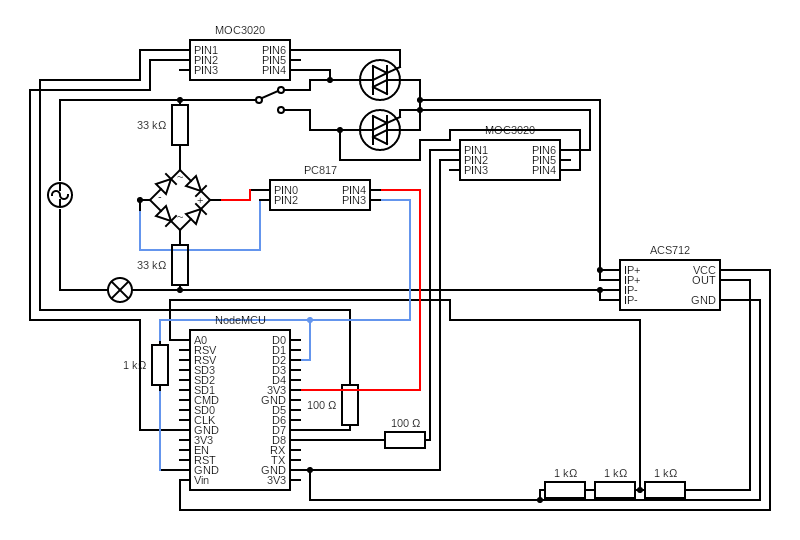
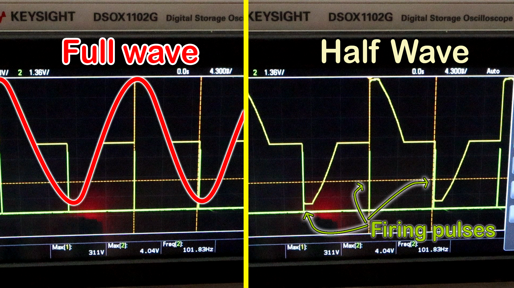
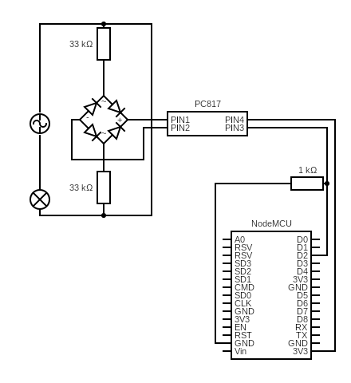

# Home Automation with Nodemcu ESP8266
Home automation with circuit diagram and code

ESP8266 with some electronics gives you control over your lights, fans or any electrical appliances leaving you resting on your sofa :).

## Circuit diagram:

## Instructions

What you need:

* 1 x Nodemcu ESP8266
* 1 x ACS712 5A
* 1 x Full Bridge Rectifier / 4 x IN4007 diode
* 1 x PC817 optocoupler
* 2 x MOC3020 optocoupler / 2 x MOC3021 optocoupler
* 2 x BTA16 triac
* 2 x 33k ohm resistor
* 2 x 100 ohm resistor
* 4 x 1k ohm resistor
* 1 x switch
* 1 x Bulb Holder
* 1 x Plug
* 1 x Soldering Iron
* 2 m Soldering wire
* 1 x Perf Board (small)
* Jumper Wires

### Zero Cross Detection
AC Current is a sine wave ranging from x to -x, when the current is zero it is called *ZERO CROSSING*. If we can control a switch very fast(~ 10ms) to cut the sine wave, we can control the power. The Triac will be a suitable component to do so. After we detect the zero crossing, we give a delay of 2000 microsenconds to 9000 microseconds then fire the triac, we can cut the sinwave accurately.

 
 - Credit goes to ElectroNoobs Youtube

 To Detect Zero Crossing we will use a Full bridge Rectifier, PC817 optocoupler, 2 33k ohm ressistors and the D2 pin of the NodeMCU.
 
 Here is the scematics:
 
 
 
 
 
